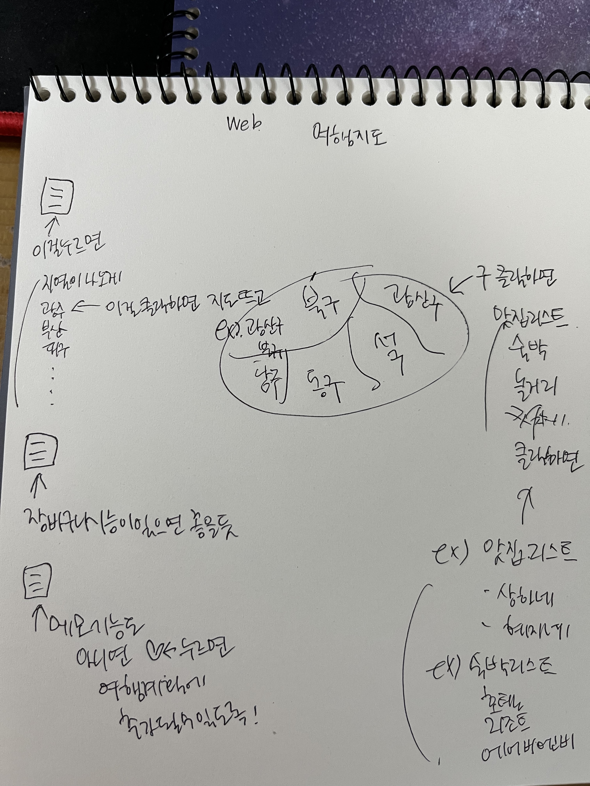

# 광주여행지도 사이트 만들기!

## 여행지도 초안 

## 기능 목록 초안

1. 메모 기능

- 계획에 필요한 기타 사항들을 메모할 수 있는 영역이 필요

- 각 여행 리스트 마다 ❤️ 버튼을 만들어 해당 버튼을 누르면 메모 기능에 추가될 수 있도록

2. 광주 지도에 따라 유저가 클릭할 수 있는 기능

- 원하는 구(북구, 서구, 남구 등)를 클릭 시 해당 동네의 맛집 숙박 놀거리를 선택하는 화면 출력
